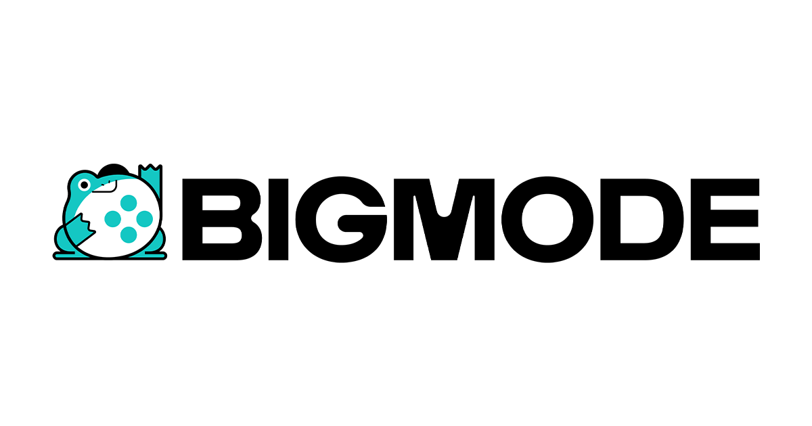

# BIGMODE Game Jam 2025



## How-To Build

### Windows Requirements
- [MinGW w64 with MSYS2](https://www.msys2.org/)

### Linux Requirements
- `gcc`, `g++` and `ar`
- standard `-dev` packages
- For Windows cross-compilation: `mingw-w64-gcc`, `mingw-w64-g++`, `mingw-w64-ar`

### Web Requirements
- [emscripten](https://emscripten.org/) (emcc, em++, emar)

### Miscellaneous
- For generating packaged files: zip

1) Make sure that raylib submodule is initialized.

```cmd
git submodule update --init
```

2) Build cbuild.

```cmd
gcc cbuild.c -o cbuild
```

3) Run cbuild in build mode.

```cmd
./cbuild build
```

Binary will be in `build/windows` or `build/linux` depending on platform.

### Web build

```cmd
./cbuild build -target=web
```

[!NOTE]
`emscripten` is required.

### Packaging

```cmd
./cbuild package
```

[!NOTE]
`zip` is required.

## Credits

- [smushy](https://github.com/smushy64) : Programmer and Artist
- sir geo                               : Artist
- grib                                  : Artist
- Clayton Dryden                        : Music

### External Resources

- [raylib](https://www.raylib.com/)

